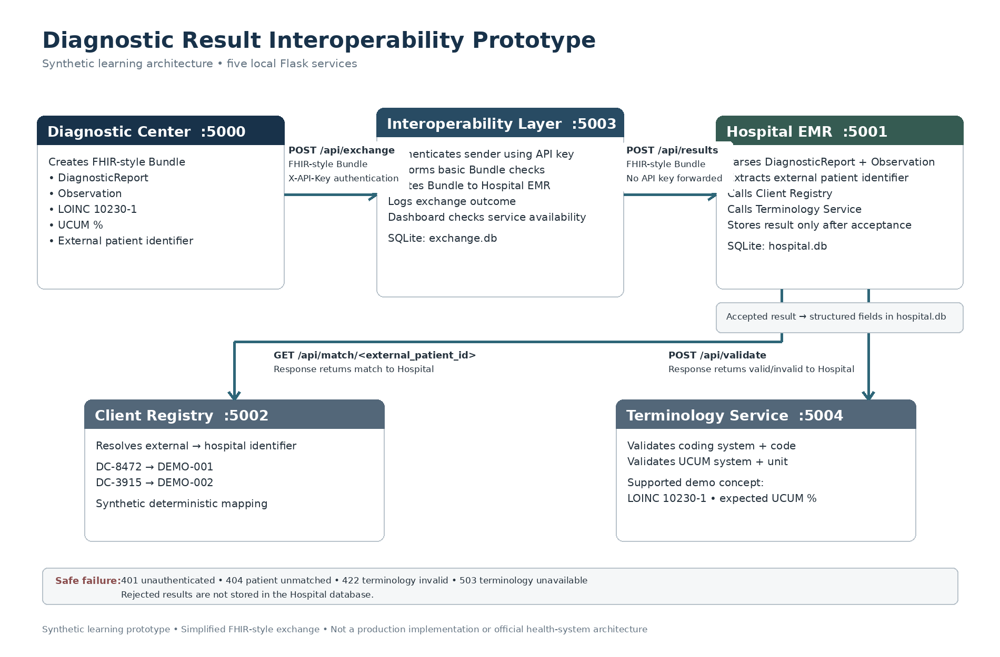

# HealthLink — Diagnostic Result Interoperability Prototype

A synthetic digital-health interoperability prototype demonstrating how an external diagnostic result can move from a diagnostic center into a hospital system as structured data rather than returning only as paper or an isolated report.

> **Scope:** Educational portfolio project using synthetic patient data. It is not a production system, is not deployed at Jimma University Medical Center (JUMC), and is not an implementation of Ethiopia's national digital-health infrastructure.



## Why I built this

During clinical training, I observed a continuity-of-information problem: investigations performed outside a hospital can return with the patient as paper results and may not become structured data inside the hospital's electronic record.

I built this prototype to understand the technical components required to exchange that information across independent health systems: structured clinical data, patient identity resolution, terminology validation, authentication, routing, audit logging, and persistence.

## What the prototype demonstrates

The prototype contains five small Flask services:

| Service | Port | Responsibility |
| --- | ---: | --- |
| Diagnostic Center | 5000 | Creates and sends a structured diagnostic result |
| Hospital EMR | 5001 | Receives, validates, and stores accepted results |
| Client Registry | 5002 | Maps an external patient identifier to a hospital identifier |
| Interoperability Layer | 5003 | Authenticates the sender, performs basic Bundle checks, routes the exchange, and records an audit log |
| Terminology Service | 5004 | Validates the supported LOINC concept and UCUM unit |

The Hospital EMR and Interoperability Layer persist data in separate SQLite databases.

## Exchange workflow

1. The Diagnostic Center creates a simplified FHIR-style `Bundle`.
2. The Bundle contains a `DiagnosticReport` and an `Observation`.
3. The Observation represents left ventricular ejection fraction using LOINC `10230-1` and UCUM `%`.
4. The Diagnostic Center sends the Bundle to the Interoperability Layer with an API key.
5. The Interoperability Layer authenticates the sender, performs basic Bundle validation, logs the exchange, and routes it to the Hospital EMR.
6. The Hospital asks the Client Registry to resolve the external patient ID to its local hospital ID.
7. The Hospital asks the Terminology Service to validate the LOINC code and UCUM unit.
8. Only after those checks succeed does the Hospital store the result in SQLite.

## Failure behavior tested

The prototype was deliberately tested beyond the successful path.

| Scenario | Expected behavior |
| --- | --- |
| Valid patient + valid terminology | `201` — accepted and stored |
| Unknown external patient ID | `404` — not stored |
| Unsupported LOINC code | `422` — not stored |
| Terminology Service unavailable | `503` — not stored |
| Missing/incorrect API key | `401` — rejected at the Interoperability Layer |

This demonstrates an important interoperability principle: receiving JSON is not enough. Identity, terminology, trust, validation, and failure handling also matter.

## Standards and technologies

- Python
- Flask
- HTTP/REST
- JSON
- FHIR-style `Bundle`, `DiagnosticReport`, and `Observation`
- LOINC
- UCUM
- SQLite
- API-key authentication for the prototype

## Important limitations

This project is intentionally simplified.

It is **not a fully conformant production FHIR server** and does not claim complete FHIR R4 conformance. The Bundle and resources are used to learn and demonstrate structured exchange concepts.

The API-key mechanism is also a learning implementation. A production environment would require stronger identity, authorization, transport security, certificate/key management, access control, governance, monitoring, and other security controls.

The Client Registry uses a small synthetic identifier map rather than probabilistic or enterprise master-patient-index matching.

The Terminology Service supports only the clinical concept needed for the demonstration.

All names and identifiers used by the prototype are synthetic.

## Running locally

### 1. Create a virtual environment

```powershell
python -m venv venv
```

### 2. Install dependencies

```powershell
.\venv\Scripts\python.exe -m pip install -r requirements.txt
```

### 3. Set the prototype API key

Set this in the PowerShell windows used for the Diagnostic Center and Interoperability Layer:

```powershell
$env:DIAGNOSTIC_API_KEY="choose-a-local-demo-key"
```

Do not commit real secrets to source control.

### 4. Start the services

Open separate terminals from the repository root:

```powershell
.\venv\Scripts\python.exe diagnostic_center\diagnostic.py
.\venv\Scripts\python.exe hospital_emr\hospital.py
.\venv\Scripts\python.exe client_registry\registry.py
.\venv\Scripts\python.exe interoperability_layer\exchange.py
.\venv\Scripts\python.exe terminology_service\terminology.py
```

Then open the Diagnostic Center at `http://127.0.0.1:5000`.

The Interoperability Layer dashboard is at `http://127.0.0.1:5003`.

## Synthetic demonstration identifiers

For local testing:

- `DC-8472` maps to hospital ID `DEMO-001`
- `DC-3915` maps to hospital ID `DEMO-002`

These identifiers and patient records are fictional and exist only for the demonstration.

## What I learned

Building the prototype helped connect digital-health concepts to implementation: why interoperability requires more than two systems being able to send HTTP requests, how clinical terminology supports semantic consistency, why patient identity has to be resolved across organizations, where an interoperability layer fits, and how rejected exchanges should fail safely rather than silently entering a clinical record.

## Project status

Learning/portfolio prototype. The next steps are repository documentation, deployment of a demonstration environment, and further exploration of production-grade interoperability and trust patterns.
